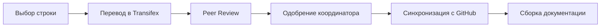

# Проект перевода учебника Python 3.14 на русский язык


## 📖 О проекте

Этот репозиторий координирует работу по переводу официального учебника Python 3.14 на русский язык. Проект является частью международной инициативы по локализации документации Python через платформу Transifex.

**Цель**: Обеспечить качественный русскоязычный перевод учебника Python для снижения барьера входа в программирование.

## 📊 Текущий статус

- **Общий прогресс перевода**: 79% 
- **Целевая версия**: Python 3.14
- **Платформа перевода**: [Transifex (python-doc)](https://app.transifex.com/python-doc/python-newest/)
- **Количество участников**: 2,180+ переводчиков
- **Общий объем**: ~50,000 слов

## 📚 Структура учебника

| № | Глава | Русский перевод | Прогресс |
|---|-------|----------------|----------|
| 1 | Whetting Your Appetite | Пробуждение аппетита | 95% |
| 2 | Using the Python Interpreter | Использование интерпретатора Python | 90% |
| 3 | An Informal Introduction to Python | Неформальное введение в Python | 85% |
| 4 | More Control Flow Tools | Дополнительные инструменты управления потоком | 80% |
| 5 | Data Structures | Структуры данных | 75% |
| 6 | Modules | Модули | 70% |
| 7 | Input and Output | Ввод и вывод | 65% |
| 8 | Errors and Exceptions | Ошибки и исключения | 60% |
| 9 | Classes | Классы | 55% |
| 10 | Brief Tour of the Standard Library | Краткий обзор стандартной библиотеки | 50% |
| 11 | Brief Tour of the Standard Library — Part II | Краткий обзор стандартной библиотеки — Часть II | 45% |
| 12 | Virtual Environments and Packages | Виртуальные окружения и пакеты | 40% |
| 13 | What Now? | Что дальше? | 35% |

## 🚀 Как присоединиться

### Требования для участников
- Свободное владение русским и английским языками
- Базовое понимание Python (желательно)
- Готовность к командной работе

### Пошаговая инструкция

1. **Регистрация на Transifex**
   ```
   https://app.transifex.com/signup/
   ```

2. **Присоединение к команде python-doc**
   ```
   https://app.transifex.com/python-doc/python-newest/
   ```

3. **Выбор русского языка и подача заявки**

4. **Присоединение к Telegram каналу команды**

5. **Знакомство с [руководством по переводу](docs/TRANSLATION_GUIDE.md)**

## 🛠 Инструменты и технологии

- **[Transifex](https://transifex.com)** — основная платформа для перевода
- **[GitHub](https://github.com)** — управление версиями и координация
- **[Telegram](https://telegram.org)** — оперативное общение команды
- **[Sphinx](https://sphinx-doc.org)** — генерация документации

## 📋 Рабочий процесс



## 🎯 Стандарты качества

### ✅ Делайте
- Сохраняйте техническую точность
- Используйте единую терминологию
- Переводите строки и комментарии в коде
- Сохраняйте форматирование разметки

### ❌ Не делайте
- Не переводите имена переменных и функций
- Не изменяйте структуру без необходимости
- Не игнорируйте контекст использования
- Не нарушайте форматирование

## 👥 Структура команды

| Роль | Количество | Обязанности |
|------|------------|-------------|
| 🎯 Координатор | 1 | Управление проектом, контроль качества |
| ✍️ Переводчики | 15-20 | Перевод текстов, адаптация примеров |
| 📝 Редакторы | 5-7 | Вычитка, унификация стиля |
| ⚙️ Техспециалисты | 2-3 | Настройка инфраструктуры |

## 📅 Временной план

- **Фаза 1 (1-2 недели)**: Подготовка команды и инфраструктуры
- **Фаза 2 (8-12 недель)**: Активный перевод и редактирование
- **Фаза 3 (2-3 недели)**: Финализация и подготовка к публикации
- **Фаза 4 (постоянно)**: Поддержка и обновления

## 📖 Документация проекта

- [📋 Руководство по переводу](docs/TRANSLATION_GUIDE.md)
- [📚 Глоссарий терминов](docs/GLOSSARY.md)
- [🎨 Стилистическое руководство](docs/STYLE_GUIDE.md)
- [🤝 Кодекс поведения](docs/CODE_OF_CONDUCT.md)
- [❓ FAQ](docs/FAQ.md)

## 🔗 Полезные ссылки

- [Оригинальный учебник Python 3.14](https://docs.python.org/3.14/tutorial/)
- [Проект python-doc на Transifex](https://app.transifex.com/python-doc/)
- [Репозиторий MLGRussianXP/python-docs-ru](https://github.com/MLGRussianXP/python-docs-ru)
- [Python Developer's Guide - Translating](https://devguide.python.org/documentation/translating/)

## 📄 Лицензия

Этот проект распространяется под лицензией **CC0 (Creative Commons Public Domain)**. 
Переводы могут свободно использоваться без каких-либо ограничений.

## 🤝 Содействие проекту

Мы приветствуем любой вклад в проект! Будь то:
- Перевод новых строк
- Вычитка существующих переводов  
- Улучшение документации
- Техническая поддержка

### Контакты
- 💬 **Telegram**: [ссылка на канал команды](https://t.me/py_docs_ru)
- 🐙 **GitHub**: [dadec666](https://github.com/dadec666)

---

**Вместе мы сделаем Python доступнее для русскоязычного сообщества! 🐍🇷🇺**
